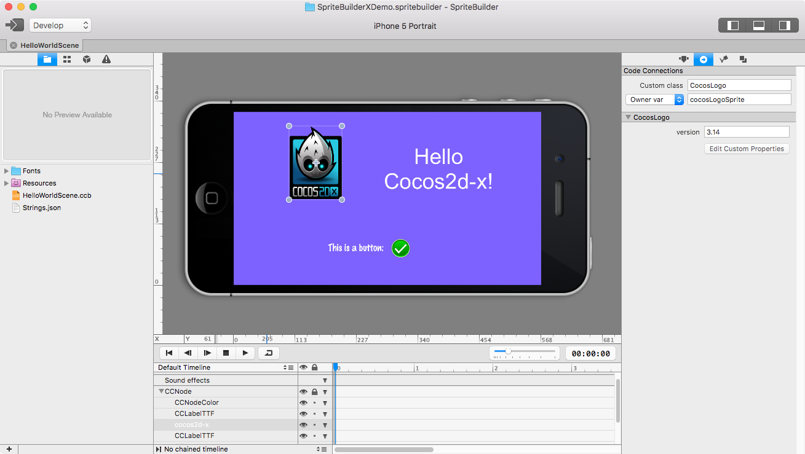
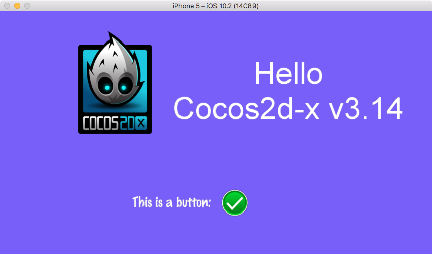

# SpriteBuilderX-Demo

Simple demo for SpriteBuilderX - https://github.com/newnon/SpriteBuilderX




```
bool HelloWorld::init() {

    if ( !Node::init() ) {
        return false;
    }

    CCBX_SIMPLE_MEMBER_VARIABLE(cocosLogoSprite);
    CCBX_SIMPLE_MEMBER_VARIABLE(labelHello);
    CCBX_SIMPLE_MEMBER_VARIABLE(clickedLabel);
    
    CCBX_SIMPLE_SELECTOR_CLICK(click);
    
    //custom loader
    cocos2d::spritebuilder::NodeLoaderLibrary *library = NodeLoaderLibrary::getDefault();
    library->registerNodeLoader("CocosLogo", &CocosLogoSpriteLoader::create);
    
    //simple loader, just examlpe, not been used or created in SBX
    using LevelNodeLoader = SimpleNodeLoader<LevelNode>;
    library->registerNodeLoader("LevelNode", &LevelNodeLoader::create);
    
    CCBXReader *reader = CCBXReader::createFromFile("HelloWorldScene.ccbi");
    cocos2d::Node * scene = reader->createNode(this, SceneScaleType::MINSCALE);
    this->addChild(scene);
    
    _labelHello->setString(StringUtils::format("Hello\nCocos2d-x v%s",_cocosLogoSprite->version.c_str()));
  
    return true;
}
```




# How to run it
  * Clone this repo, recursive submodules
  * Run `SpriteBuilderX-Demo/cocos2d/download-deps.py`
  * Clone https://github.com/newnon/SpriteBuilderX
  * Build & Run `SpriteBuilderX` and then open project `SpriteBuilderX-Demo/SpriteBuilderXDemo.spritebuilder`
  * Publish project using `File -> Publish`
  * Now you can run `SpriteBuilderX-Demo` project in Xcode
  * Enjoy
